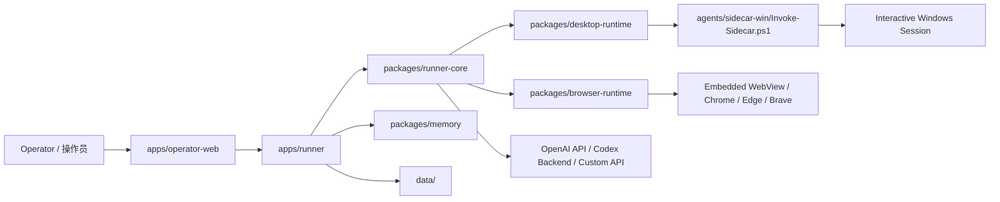

# Novaper

Novaper 是一个面向 Windows 的本地 AI 电脑操作系统。它把实时桌面观察、原生应用控制、内嵌浏览器 DOM 自动化、任务规划、可回放日志、记忆系统和 Electron 桌面端整合进同一个项目。  
Novaper is a local Windows-first AI computer operator. It combines live desktop observation, native app control, embedded browser DOM automation, task planning, replayable logs, memory, and an Electron desktop shell in one repository.

## 项目定位 | What Novaper Is

- 面向真实 Windows 桌面会话，而不是纯聊天 UI 或单纯脚本执行器。  
  Built for real interactive Windows desktop sessions, not just a chat UI or a script runner.
- 既支持浏览器 DOM 级自动化，也支持原生桌面软件控制。  
  Supports both browser DOM automation and native desktop control.
- 以“优先使用结构化工具，必要时退回视觉操作”为核心策略。  
  Follows a structured-tools-first strategy with visual fallback only when needed.
- 每次任务都可以留下事件流、截图、日志和回放数据，方便调试与回归。  
  Persists events, screenshots, logs, and replay data for debugging and regression work.

## 核心能力 | Highlights

- 实时桌面 Agent：观察当前桌面，逐步执行任务并返回工具调用与验证结果。  
  Live desktop agent: observe the current desktop, execute step by step, and stream tool results with verification.
- Electron 桌面端：提供主控界面、内嵌浏览器入口和本地应用集成。  
  Electron desktop shell: provides the main UI, an embedded browser entry, and local app integration.
- DOM 优先浏览器控制：网页任务优先走 `browser_*`，直接读取页面 DOM 与文本内容。  
  DOM-first browser control: web tasks prefer `browser_*` tools and read page DOM/text directly.
- Windows 原生控制：支持 UI Automation、窗口管理、进程管理、文件操作和输入模拟。  
  Native Windows control: supports UI Automation, window/process management, file ops, and input simulation.
- 路由与规划：在 `desktop`、`cli`、`planner` 三条执行路径之间自动选择。  
  Routing and planning: switches between `desktop`, `cli`, and `planner` execution routes.
- 双认证模式：支持 `OPENAI_API_KEY` 与本地 `Codex OAuth`。  
  Dual auth paths: supports both `OPENAI_API_KEY` and local `Codex OAuth`.
- 多种 Agent 策略：内置 `GLM / MAI / Gemini / Midscene / DroidRun / Codex` 执行风格。  
  Multiple agent strategies: ships with `GLM / MAI / Gemini / Midscene / DroidRun / Codex` execution styles.

## 当前形态 | Current Modes

- `Live Desktop Operator`  
  实时观察桌面，发送单条指令，查看工具调用、截图、总结与错误。  
  Observe the desktop live, send one instruction at a time, and inspect tool calls, screenshots, summaries, and errors.

- `Scenario Runner`  
  运行预定义场景，持久化结构化事件，并导出可回放工件。  
  Execute predefined scenarios, persist structured events, and export replayable artifacts.

## 架构总览 | Architecture



## 仓库结构 | Repository Layout

| 路径 | 说明 |
| --- | --- |
| `apps/operator-web` | React + Vite 控制台，负责聊天、历史、设置、浏览器页、日志和设备面板。 / React + Vite operator console for chat, history, settings, browser page, logs, and device panels. |
| `apps/runner` | Express 服务端，负责 session、auth、SSE、历史、日志和任务编排。 / Express backend for sessions, auth, SSE, history, logs, and orchestration. |
| `packages/runner-core` | 工具注册、指令路由、任务规划、桌面循环、CLI 循环。 / Tool registry, routing, planning, desktop loop, and CLI loop. |
| `packages/browser-runtime` | Chromium / Playwright 浏览器运行时。 / Managed Chromium / Playwright browser runtime. |
| `packages/desktop-runtime` | Node 到 PowerShell sidecar 的桥接层。 / Node bridge to the PowerShell sidecar. |
| `packages/memory` | 工作记忆、长期记忆、应用上下文记忆。 / Working memory, long-term memory, and app-context memory. |
| `agents/sidecar-win` | Windows 侧实际执行层。 / The Windows execution sidecar. |
| `electron` | Electron 主进程、preload、内嵌浏览器管理。 / Electron main process, preload, and embedded browser management. |
| `docs` | 产品、架构、部署和 API 文档。 / Product, architecture, setup, and API docs. |
| `data` | 运行时数据、回放、日志、记忆、认证信息。 / Runtime data, replays, logs, memory, and auth state. |

## 环境要求 | Requirements

- Windows 10 / 11，且必须是交互式登录桌面会话。  
  Windows 10 / 11 with an interactive logged-in desktop session.
- Node.js 20+  
  Node.js 20+
- PowerShell  
  PowerShell
- 如需网页 DOM 自动化，建议本机安装 Chrome / Edge / Brave。  
  Install Chrome / Edge / Brave if you want DOM-aware browser automation.
- 一种模型认证方式：`OPENAI_API_KEY` 或 `Codex OAuth`。  
  One model auth path: `OPENAI_API_KEY` or `Codex OAuth`.

## 快速开始 | Quick Start

### 1. 安装依赖 | Install dependencies

```powershell
npm install
npm install --prefix apps/operator-web
```

### 2. 准备环境变量 | Prepare environment variables

如果仓库里带有 `.env.example`，先复制一份再修改。  
If the repo includes `.env.example`, copy it first and then edit it.

```powershell
if (Test-Path .env.example) { Copy-Item .env.example .env }
```

### 3. 启动本地 Runner | Start the local runner

```powershell
npm start
```

打开 `http://127.0.0.1:3333`。  
Open `http://127.0.0.1:3333`.

### 4. 启动 Electron 桌面端 | Start the Electron desktop app

```powershell
npm run electron:dev
```

这个命令会先启动前端 dev server，再拉起 Electron 主进程。  
This command starts the frontend dev server first, then launches the Electron main process.

## 常用脚本 | Common Scripts

| 命令 | 说明 |
| --- | --- |
| `npm start` | 启动本地 Runner。 / Start the local runner. |
| `npm run dev` | 监听模式启动 Runner。 / Start the runner in watch mode. |
| `npm run --prefix apps/operator-web build` | 构建前端并做 TypeScript 检查。 / Build the frontend and run TypeScript checks. |
| `npm run build:electron` | 构建 Electron 主进程产物。 / Build Electron main-process artifacts. |
| `npm run electron:dev` | 本地调试 Electron 桌面端。 / Run the Electron desktop app in development mode. |
| `npm run electron:build:win` | 本地打包 Windows 安装包。 / Package the Windows installer locally. |

## 认证与模型 | Auth and Model Configuration

### `OPENAI_API_KEY`

适合直接走官方 OpenAI API 的场景。  
Use this when you want the official OpenAI API path.

- 环境变量：`OPENAI_API_KEY`
- 可选模型变量：`OPENAI_MODEL`

### `Codex OAuth`

适合不想在本地保存 `OPENAI_API_KEY`、而是通过本地 Codex 登录来工作的场景。  
Use this when you prefer authenticating through local Codex login instead of storing `OPENAI_API_KEY`.

- 回调地址：`http://localhost:1455/auth/callback`
- 凭据保存位置：`data/auth/codex-oauth.json`

说明：  
Notes:

- Provider 和 Agent 现在是解耦的。  
  Provider and Agent strategy are now decoupled.
- 你可以选择 `Codex OAuth`，同时继续使用 `GLM / MAI / Midscene / Codex` 等不同执行策略。  
  You can use `Codex OAuth` while still selecting `GLM / MAI / Midscene / Codex` or other execution strategies.

## Agent 策略 | Agent Strategies

这些选项表示“执行风格”，不是不同仓库的硬编码模型后端。  
These options define execution style, not a separate hardcoded model backend.

- `GLM Agent`：稳定、保守、低波动，适合大多数通用桌面任务。  
  Stable and low-variance. Best default for general desktop work.
- `MAI Agent`：更偏 planner，擅长长流程、多状态 GUI 任务。  
  Planner-forward with stronger rolling visual context. Good for long GUI flows.
- `Gemini Agent`：强调 `state -> action -> result` 结构，调试体验更好。  
  Tool-calling-first with explicit state/action/result structure.
- `Midscene Agent`：偏浏览器和网页流程，优先 `browser_*` 与 DOM 路径。  
  Browser-first and DOM-oriented. Best fit for web tasks.
- `DroidRun Agent`：更像移动端导航循环，适合一步一步切页面的流程。  
  Mobile-style navigation loop, useful for stepwise navigation workflows.
- `Codex Agent`：简洁、工具优先、验证驱动，适合要快且少废话的执行方式。  
  Concise, tool-first, verification-driven, and optimized for fast execution.

## 控制策略 | Control Strategy

Novaper 不会用同一种控制方式硬套所有任务。  
Novaper does not force every task through the same control path.

网页任务优先级：  
Web priority order:

1. `browser_*` DOM 工具  
   `browser_*` DOM tools
2. 内嵌浏览器或 Playwright 会话中的结构化交互  
   Structured interaction in the embedded browser or Playwright session
3. 如 DOM 路径失败，再退回截图驱动的 `desktop_actions`  
   Fall back to screenshot-driven `desktop_actions` only when DOM control fails

原生 Windows 软件优先级：  
Native Windows app priority order:

1. UI Automation 与确定性工具  
   UI Automation and deterministic tools
2. 窗口、进程、文件等系统工具  
   Window, process, and file tools
3. 视觉兜底  
   Visual fallback

## 内嵌浏览器 | Embedded Browser

Electron 桌面端内置了可切换的浏览器页面入口。  
The Electron desktop app includes a dedicated embedded browser entry.

当前特性：  
Current behavior:

- Agent 调用 `browser_*` 时，可以直接落到 Electron 内嵌 WebView。  
  `browser_*` calls can target the Electron embedded WebView directly.
- `browser_snapshot` / `browser_read` 读取真实 DOM 内容，而不是只看截图。  
  `browser_snapshot` / `browser_read` inspect real DOM content instead of relying on screenshots only.
- 会尝试导入本机 Chromium profile，以复用常见站点状态。  
  The app attempts to import the local Chromium profile to reuse common site state.

当前边界：  
Current boundary:

- 某些 Windows 下受 Chrome App-Bound Encryption 保护的敏感登录态，无法仅靠文件复制完整复用。  
  Some Windows Chrome identities protected by App-Bound Encryption cannot be fully reused through file copying alone.
- 这类站点可能需要在内嵌浏览器中重新登录，或改走真实 Chrome / CDP / relay 方案。  
  Those sites may require logging in again inside the embedded browser, or using a real Chrome / CDP / relay path.

## 运行数据目录 | Runtime Data

- `data/live-sessions`：实时任务 session、事件和截图。  
  Live session records, events, and screenshots.
- `data/runs`：场景运行记录与回放工件。  
  Scenario runs and replay artifacts.
- `data/logs`：本地日志。  
  Local logs.
- `data/memory`：长期记忆、应用记忆、会话快照。  
  Long-term memory, app memory, and session snapshots.
- `data/auth`：认证凭据。  
  Auth credentials.
- `data/automation`：工作流与定时任务状态。  
  Workflow and scheduled-task state.

## 发布流程 | Release Workflow

仓库已经配置 GitHub Actions Release 工作流。  
The repository already includes a GitHub Actions release workflow.

- 推送 `v*` tag 会自动触发 Windows / macOS / Linux 三个平台构建。  
  Pushing a `v*` tag automatically triggers Windows / macOS / Linux builds.
- 构建完成后会自动创建 GitHub Release 并上传产物。  
  After the builds finish, GitHub Release is created automatically and artifacts are uploaded.
- 工作流文件：[`/.github/workflows/release.yml`](./.github/workflows/release.yml)  
  Workflow file: [`/.github/workflows/release.yml`](./.github/workflows/release.yml)

## 文档导航 | Documentation

- [产品概览 | Product Overview](./docs/product-overview.md)
- [架构设计 | Architecture](./docs/architecture.md)
- [安装与认证 | Setup and Auth](./docs/setup-and-auth.md)
- [桌面与浏览器自动化 | Desktop and Browser Automation](./docs/desktop-automation.md)
- [API 参考 | API Reference](./docs/api-reference.md)
- [路线图 | Roadmap](./docs/roadmap.md)

## 当前边界 | Current Boundaries

- 当前仍然是本地机、Windows 优先的单机产品。  
  This is still a local-machine, Windows-first product.
- 某些第三方桌面应用的 UIA 树不完整，仍需要视觉兜底。  
  Some third-party desktop apps still require visual fallback because their UIA trees are incomplete.
- 浏览器自动化优先面向 Chromium 家族。  
  Browser automation primarily targets Chromium-family browsers.
- 复杂账号体系与高安全站点，可能需要更专门的浏览器 relay / CDP 接入。  
  Complex identity-heavy sites may still require dedicated browser relay / CDP integration.

## 许可证 | License

当前仓库未在根目录显式提供许可证文件时，请在使用前先确认项目维护者的授权方式。  
If the repository does not include an explicit root license file, confirm usage terms with the maintainers before redistribution or commercial use.
