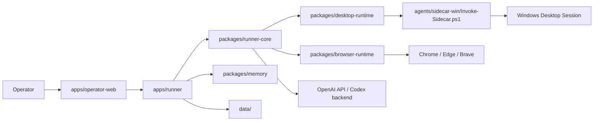

# Novaper

Novaper is a Windows-first AI computer operator. It combines a local runner, a browser control panel, a PowerShell sidecar, structured replay data, memory, task planning, and browser automation into one system.

Current repository modes:
- `Live Desktop Operator`: observe the current desktop, send one instruction at a time, and watch the agent execute in real time.
- `Scenario Runner`: execute predefined scenarios, persist events and screenshots, and export replay artifacts.

## What It Can Do

- Control native Windows apps through UI Automation, window management, process control, and file operations
- Fall back to screenshot-driven `desktop_actions` when UIA is unreliable
- Control Chromium browsers with DOM-aware tools backed by `playwright-core` and a persisted automation profile
- Route instructions between desktop execution, CLI execution, and multi-step planning
- Persist live sessions, runs, logs, memory, screenshots, and replay artifacts under `data/`
- Support both `OPENAI_API_KEY` and local `Codex OAuth`

## Architecture Summary



## Repository Layout

- `apps/operator-web`: browser UI for live sessions, history, logs, and memory views
- `apps/runner`: Express server, auth, SSE, session orchestration, scenario execution
- `packages/runner-core`: routing, tool registry, desktop loop, CLI loop, planner, video observer
- `packages/browser-runtime`: managed Chromium session layer for DOM-aware browser control
- `packages/desktop-runtime`: Node bridge for the PowerShell sidecar
- `packages/memory`: working memory, long-term memory, app context memory, persistence
- `packages/scenario-kit`: scenario loading
- `packages/replay-schema`: shared run/session types
- `packages/verifier-kit`: scenario verification helpers
- `agents/sidecar-win`: Windows PowerShell sidecar implementation
- `scenarios`: sample scenarios
- `data`: runtime state, screenshots, logs, memory, replays, auth artifacts

## Quick Start

1. Install dependencies

```powershell
npm install
```

2. Copy environment variables

```powershell
Copy-Item .env.example .env
```

3. Start the runner

```powershell
npm start
```

4. Open the control panel

[http://127.0.0.1:3333](http://127.0.0.1:3333)

## Environment Variables

- `OPENAI_API_KEY`: use the official OpenAI API path
- `OPENAI_MODEL`: default model, defaults to `gpt-5.4`
- `PORT`: runner port, defaults to `3333`
- `HOST`: bind address, defaults to `127.0.0.1`
- `NOVAPER_PROXY_URL`: explicit proxy override for Novaper network traffic
- `HTTPS_PROXY`, `HTTP_PROXY`, `ALL_PROXY`: standard proxy fallbacks

## Auth Modes

### OpenAI API Key

Use this when you want the official OpenAI SDK path and optional official `computer` tool support.

### Codex OAuth

Use this when you want to authenticate through local ChatGPT Codex login instead of storing `OPENAI_API_KEY`. This path uses Novaper's own tools and local history management instead of relying on the official `computer` tool.

OAuth callback:
- `http://localhost:1455/auth/callback`

Stored credential:
- `data/auth/codex-oauth.json`

## Tool Strategy

Novaper does not use one control method for everything.

For web pages:
- `browser_*` tools first
- `desktop_actions` only as a fallback

For native Windows apps:
- UIA and deterministic tools first
- process, file, and window tools next
- `desktop_actions` as fallback

When available through the provider:
- official `computer` tool is supplemental, not the primary path

## Runtime Data

- `data/live-sessions`: live session state, events, screenshots
- `data/runs`: scenario runs and replay exports
- `data/logs`: intercepted server logs
- `data/memory`: app profiles, long-term memory, session snapshots
- `data/auth`: Codex OAuth credentials

## Documentation

- [Product Overview](./docs/product-overview.md)
- [Roadmap](./docs/roadmap.md)
- [Architecture](./docs/architecture.md)
- [Setup and Auth](./docs/setup-and-auth.md)
- [Desktop and Browser Automation](./docs/desktop-automation.md)
- [API Reference](./docs/api-reference.md)

## Current Boundaries

- This is still a local-machine Windows-focused system, not a multi-tenant platform
- Browser automation currently targets installed Chromium browsers only
- Some third-party desktop apps still require vision fallback because their UIA trees are incomplete
- `set_display_profile` validates requested settings but does not mutate the Windows display configuration yet
