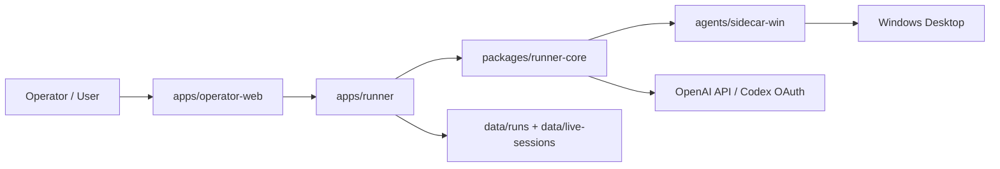

# Novaper

Novaper 是一个面向 Windows 的 AI 电脑操作平台。它把模型推理、桌面观测、PowerShell sidecar、回放归档和实时控制台整合到同一个本地系统里，目标是让 AI 能够像操作员一样“看见桌面、理解指令、执行动作、记录过程”。

当前仓库已经包含两条工作路径：
- `Live Desktop Operator`：一边查看当前桌面，一边接受自然语言指令并执行。
- `Scenario Runner`：按预定义场景运行流程，输出事件、截图和 replay 归档。

## 核心能力

- 实时桌面观察：定期截图、窗口列表、SSE 事件流。
- Windows 操作能力：进程、窗口、文件、UI Automation、键鼠动作、批量动作执行。
- 双认证模型接入：`OPENAI_API_KEY` 与 `Codex OAuth` 并存。
- 纯视觉 fallback：当 UIA 不稳定时，模型可以基于当前截图计算坐标，并通过 `desktop_actions` 执行鼠标键盘操作。
- 可回放运行记录：场景执行会产出结构化事件、截图和 zip replay。

## 文档导航

- [产品概览](./docs/product-overview.md)
- [系统架构](./docs/architecture.md)
- [安装、启动与认证](./docs/setup-and-auth.md)
- [桌面自动化策略](./docs/desktop-automation.md)
- [HTTP API 参考](./docs/api-reference.md)

## 架构概览



## 快速开始

1. 安装依赖

```powershell
npm install
```

2. 配置环境变量

复制 `.env.example` 到 `.env`，按需填写：

- `OPENAI_API_KEY`：如果你走官方 API key 路线。
- `OPENAI_MODEL`：默认 `gpt-5.4`。
- `PORT`：默认 `3333`。
- `HOST`：默认 `127.0.0.1`。
- `NOVAPER_PROXY_URL`：显式指定代理。
- `WINAI_PROXY_URL`：旧变量名，仍兼容。

3. 启动服务

```powershell
npm start
```

4. 打开控制台

[http://127.0.0.1:3333](http://127.0.0.1:3333)

## 认证模式

### OpenAI API Key

服务启动前设置 `OPENAI_API_KEY`。当 API key 存在时，默认 provider 为 `api-key`。

### Codex OAuth

无需 `OPENAI_API_KEY`，可在控制台点击 `Login Codex` 发起本地 OAuth 流程。

- 授权页会在浏览器中打开。
- 回调地址固定为 `http://localhost:1455/auth/callback`。
- 刷新后的凭据保存在 `data/auth/codex-oauth.json`。

注意：
- `1455` 端口必须空闲。
- Codex OAuth 当前通过 `https://chatgpt.com/backend-api/codex` 传输层工作。
- Codex OAuth 路径下不依赖官方 `computer` tool，优先走 Novaper 自己的桌面工具。

## 仓库结构

- `apps/runner`：HTTP API、SSE、auth、live session 和 run 管理。
- `apps/operator-web`：浏览器控制台，用于实时查看桌面并发指令。
- `packages/runner-core`：agent loop、工具注册和桌面执行编排。
- `packages/desktop-runtime`：Node 对 sidecar 的封装。
- `packages/scenario-kit`：场景 manifest 和 verifier 加载。
- `packages/replay-schema`：run/replay 结构定义。
- `agents/sidecar-win`：Windows PowerShell sidecar。
- `scenarios`：示例场景。

## 当前边界

- 当前仍是单机本地 MVP，不含多机调度和权限体系。
- 没有 RBAC、PII 遮罩、灰度发布和自动恢复策略。
- `set_display_profile` 目前只做参数校验，不实际修改系统显示设置。
- 一些第三方桌面应用的 UIA 暴露并不稳定，因此需要视觉 fallback。
