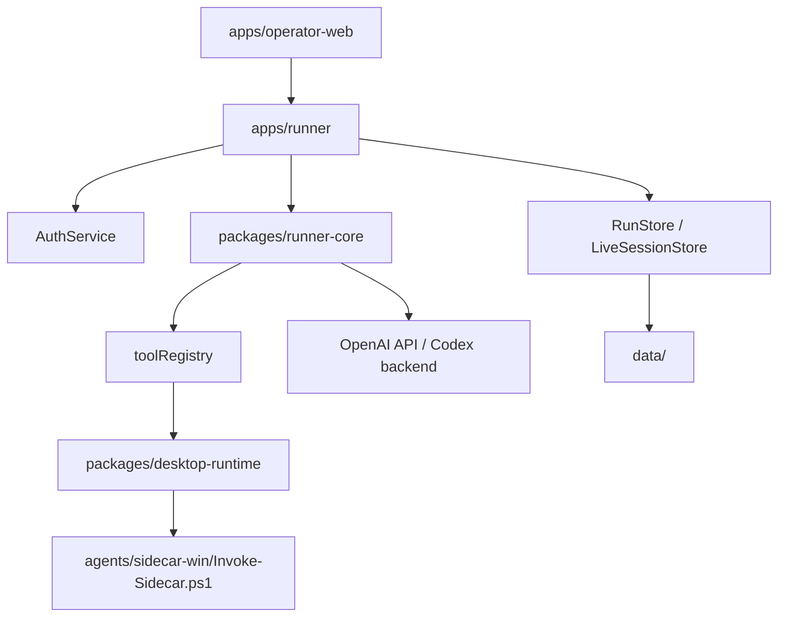
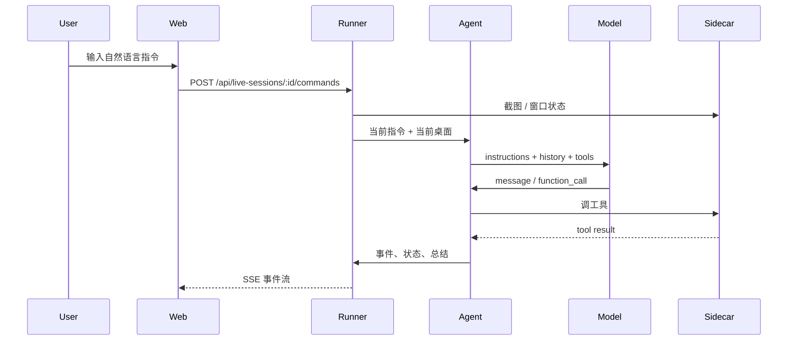

# Novaper 系统架构

## 组件分层

## 组件职责

### `apps/operator-web`

浏览器控制台。负责：
- 展示桌面截图
- 展示窗口列表和事件流
- 创建 live session
- 发送实时指令
- 发起 Codex OAuth 登录

### `apps/runner`

系统入口服务。负责：
- 暴露 HTTP API
- 持久化 run/live session
- 提供 SSE 事件流
- 管理认证状态
- 调度 agent loop

### `packages/runner-core`

智能执行层。负责：
- 构建 prompt
- 暴露 function tools
- 在回合之间整理 history
- 解析模型输出
- 决定何时继续、何时结束

### `packages/desktop-runtime`

Node 与 Windows sidecar 的桥接层。负责：
- 调用 PowerShell 脚本
- 传递结构化命令
- 处理截图与动作返回结果

### `agents/sidecar-win`

与真实 Windows 会话交互。负责：
- UI Automation
- 鼠标键盘输入
- 窗口和进程管理
- 文件和截图能力

## Live Session 数据流

## 认证架构

Novaper 支持两种 provider：

### 1. `api-key`

- 通过 `OPENAI_API_KEY` 初始化官方 OpenAI SDK。
- 可以使用官方 Responses API 和官方 `computer` tool。
- 更贴近公开文档能力。

### 2. `codex-oauth`

- 通过本地 OAuth 回调获取 ChatGPT Plus/Pro 的 Codex 登录态。
- 使用自定义 transport 访问 Codex backend。
- 不依赖官方 `computer` tool。
- 更依赖 Novaper 自己的 function tools 与视觉输入。

## 为什么需要自定义 Codex transport

Codex OAuth 路径并不完全等同于公开 OpenAI SDK 接口。当前实现专门处理了这些差异：
- 请求必须带 `instructions`
- 请求必须开启 `stream`
- 不支持 `previous_response_id`
- 不支持官方 `computer` tool
- 需要自行维护本地 history

因此 `apps/runner/src/codexResponsesClient.ts` 单独承担了兼容层职责。

## 数据落盘

运行数据保存在 `data/`：
- `data/auth`：OAuth 凭据
- `data/live-sessions`：实时会话状态、事件和截图
- `data/runs`：场景执行数据与 replay 归档

发布仓库时，这些目录默认忽略运行时内容，只保留占位文件。

## 关键设计选择

### 1. 先工具，后视觉

能稳定调用的结构化工具优先于视觉点按。这样更快、更少误点，也更容易复盘。

### 2. 视觉 fallback 作为保底能力

一旦 UIA 失败，仍然可以通过截图加 `desktop_actions` 完成微信、WPS 一类应用的操作。

### 3. 所有动作都可追踪

Novaper 不走“黑箱执行”，每一轮都会写入事件流，便于你在控制台或 replay 中还原问题。
