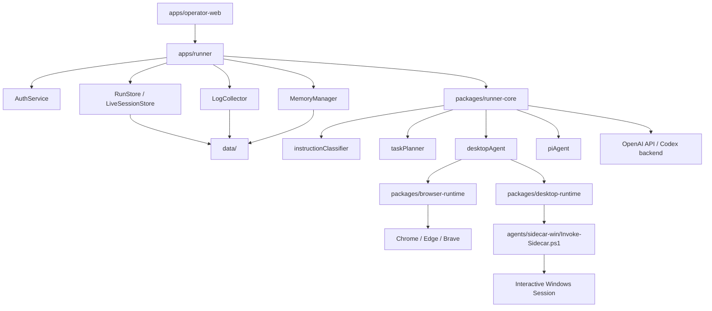
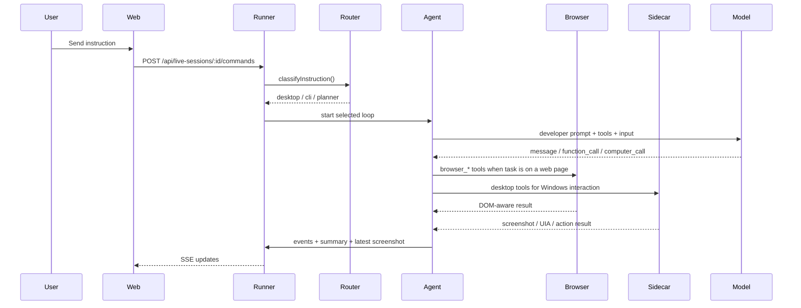

# Architecture

## Top-Level Layout

## Responsibilities By Area

### `apps/operator-web`

The browser control panel. It is responsible for:

- creating live sessions
- observing the desktop
- sending live instructions
- rendering event streams, screenshots, logs, history, and memory views

### `apps/runner`

The local HTTP entrypoint. It is responsible for:

- exposing the API surface
- restoring and persisting runs and live sessions
- managing auth selection
- wiring agent loops to storage and SSE streams
- exposing logs, memory, history, and replay downloads

### `packages/runner-core`

The execution orchestration layer. It is responsible for:

- routing instructions to `cli`, `desktop`, or `planner`
- generating and updating task plans
- building the tool registry
- running the desktop loop
- running the CLI loop
- handling video frame streaming support

### `packages/browser-runtime`

The managed Chromium layer. It is responsible for:

- finding an installed Chromium browser
- launching and reusing a session per Novaper live session
- exposing DOM-aware operations such as open, navigate, tab control, snapshot, click, type, keypress, scroll, wait, and read

### `packages/desktop-runtime`

The Node bridge to the Windows sidecar. It is responsible for:

- converting structured tool requests into sidecar RPC calls
- returning screenshots, UIA results, action results, and machine metadata

### `agents/sidecar-win`

The actual Windows execution layer. It is responsible for:

- screenshots
- window enumeration and focusing
- process management
- file operations
- UI Automation lookup and invocation
- mouse and keyboard simulation

### `packages/memory`

The memory subsystem. It is responsible for:

- app-aware context injection
- long-term recall
- working-memory snapshots across sessions
- extracting durable memories from completed sessions

## Live Session Flow

## Routing Model

The runner uses three execution routes:

- `desktop`: standard live desktop flow
- `cli`: shell/file-oriented path through `drivePiAgent`
- `planner`: decomposes a complex instruction into subtasks, then executes each subtask with either the desktop or CLI path

This means one live instruction can become a multi-step plan while still producing one coherent session history.

## Tool Selection Strategy

The live developer prompt in `apps/runner/src/server.ts` now encodes this preference order:

1. `browser_*` tools for web pages in Chromium browsers
2. UI Automation and deterministic desktop tools
3. process, file, and window tools
4. `desktop_actions` for coordinate-based fallback
5. official `computer` tool when the provider supports it

This order matches the actual implementation and is important for reliability.

## Persistence Model

### Runs

Stored under `data/runs/<run-id>/`.

Typical artifacts:

- `run.json`
- `events.jsonl`
- screenshots
- replay zip

### Live Sessions

Stored under `data/live-sessions/<session-id>/`.

Typical artifacts:

- `session.json`
- `events.jsonl`
- screenshots

### Memory

Stored under `data/memory/`.

Includes:

- app profiles
- global memory entries
- session snapshots

### Logs

Stored under `data/logs/` as daily JSONL files.

## Auth Architecture

Novaper supports two auth providers:

- `api-key`: official OpenAI SDK path
- `codex-oauth`: custom transport for the Codex backend, with local history and tool compatibility handling

The key compatibility layer is `apps/runner/src/codexResponsesClient.ts`. That module keeps Codex OAuth requests aligned with the backend's actual behavior instead of assuming parity with the official OpenAI API.
